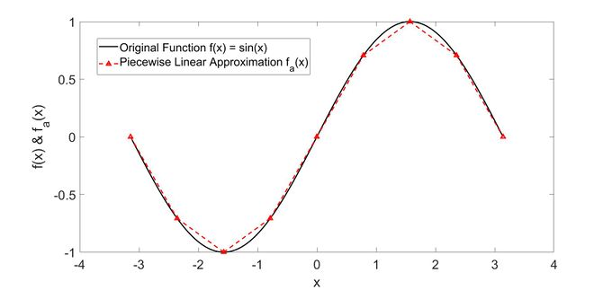
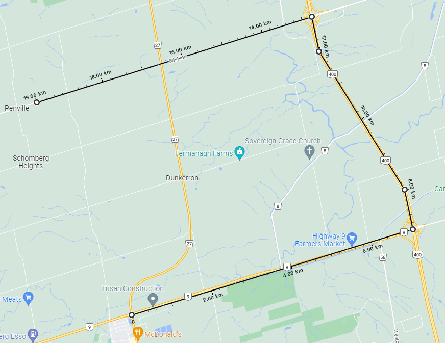
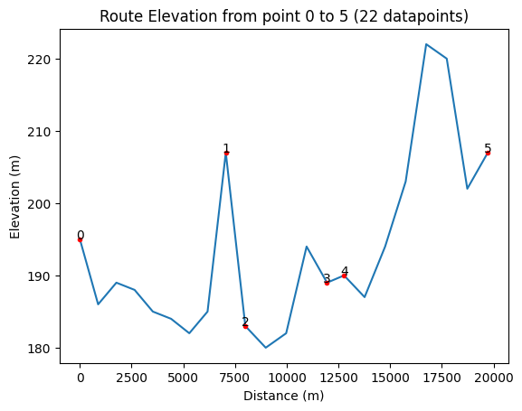
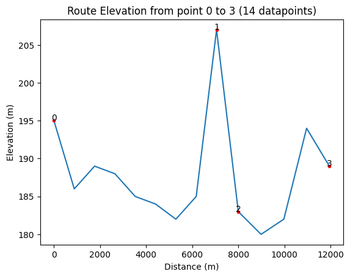
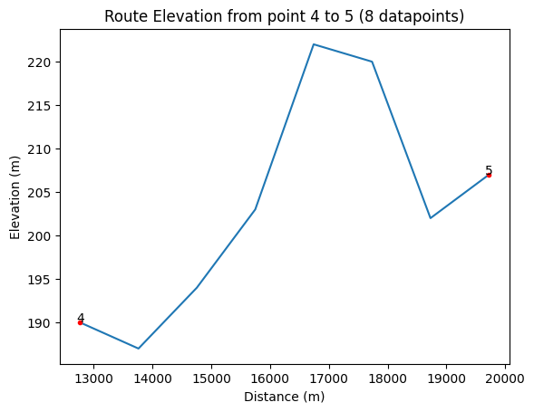

# RouteElevation


## Introduction
RouteElevation is a class that calulates and graphs the elevation data of a route that is represented by a [polygonal chain](https://en.wikipedia.org/wiki/Polygonal_chain) (where each vertex on the polygonal chain represents a real-life coordinate).

For example, if our route was the sine function (shown below), the polygonal chain would basically be the red piecewise linear approximatation. The verteces of the chain will represent coordinate points and will need to be in sequential order of the route.

It is best to add a new vertex whenever the polygonal chain starts to deviate 10-15 degrees from the route (but note that the more vertices you add, the longer the algorithm will need to take). Short curves can be exempted from this rule (see vertices that are at the peaks/troughs of the sine curve)



---
## User Guide
When using this, there are only 3 things that you need to know:

- The object initialization
- The `get_elevations()` method
- The `get_dataframe()` method
- The `plot_elevations()` method

### The object initialization
Initializing the object requires 2 required parameters: `coordinates` and `BING_MAPS_API_KEY`, and 3 optional parameters: `sample_frequency_upper_bound`, `offset`, and `debug`.

- `coordinates` (required): This is the polygonal chian that represents the route. It is of the form `[(Lat1,Long1), (Lat2,Long2)...(LatN,LongN)]` and requires at least 2 coordinates.
- `BING_MAPS_API_KEY` (required): This string is your API key for Bing Maps
- `sample_frequency_upper_bound` (optional, `default=1000`): When getting elevations, we not only get the eleavtions at 2 adjacent coordinates (vertices), but we also get the elevation at equally-distanced intervals between the 2 adjacent coordinates. The `sample_frequency_upper_bound` is an `Int` that represents the upper bound (in meters) for the interval distance for the "in-between" sample points that are used. 
- `offset` (optional, `default=0`): This is used to offset the starting distance of the route (in meters). For example, let's say the route starts 3km into the race. If you want the route to start counting from 3km rather than 0km, you would set the `offset` value to 3000
- `debug` (optional, `default=False`): Set this value to `True` if you want the object to print data upon each step of the algorithm (for debugging purposes). Otherwise, set to `False`

> Note: there is a maximum of 1023 intervals that we can use between 2 coordinates, so the `sample_frequency_upper_bound` may be overwritten if the distance between the adjacent coordinates exceeds `sample_frequency_upper_bound*1023`. To fix this issue, divide the "line segment" into multiple smaller segments

Do not change any class variables after initializing the object. Doing so may break the flow of the algorithm, resulting in an error. Create a new object instead.

### The `get_elevations()` method
This method returns the distance and the elevation of a route in 2 seperate arrays (one for the distance and one for the elevation). The `i-th` element in the elevation array represents the elevation for the `i-th` distance value. 

This method can take 0 or 2 parameters. If there are no parameters, the method will return all the distances and their associated elevations of the route. In the case of having 2 parameters, `start_point` and `end_point`, they will represent the start and end coordinates that you want to get elevations from (0-indexed). This means that the method will return you all the elevations starting from `start_point` to `end_point` (inclusive)

### The `get_dataframe()` method
This has the exact same functionality as the `get_elevations` method, but returns it as a Pandas DataFrame

### The `plot_elevations()` method
This method is similar to the `get_elevations()` method, but plots a graph rather than returning data.

Similarly to `get_elevations()`, this method can take 0 or 2 parameters. If there are 0 parameters, all elevation data will be plotted. If there are 2 parameters, all elevation data starting from `start_point` to `end_point` (0-indexed and inclusive) will be plotted as well as "markers" to show the different "line segments"


---
## Tutorial

> Make sure you have your API key for Bing Maps and place it in the class

Let's say I want to measure the route from McDonalds (bottom left) to Penville (top left). The black route (shown below) would be the polygonal chain representation of our route that we wish to get elevations for.



### First, we will need get all 6 coordinates:
```
coordinates = [(44.0104111274582, -79.67866520101909), (44.028996763626, -79.59455210533561), (44.037352902093524, -79.596693165953), (44.067688969642624, -79.62238589336177), (44.07494094439971, -79.62452695397917), (44.05647962446555, -79.70741658645272)]
```

### Next, we create a RouteElevation object using our coordinates:
```
route = RouteElevation(coordinates=coordinates, BING_MAPS_API_KEY=BING_MAPS_API_KEY, sample_frequency_upper_bound=1000, offset=0, debug=False)
```

### We can get the elvations of our route:
```
distance, elevation = route.get_elevations() # All distances and elevations
print(distance, elevation)

distance, elevation = route.get_elevations(0,3) # Distances and elevations from coordinate 0 to coordinate 3 (inclusive)
print(distance, elevation)

distance, elevation = route.get_elevations(4,5) # Distances and elevations from coordinate 4 to coordinate 5 (inclusive)
print(distance, elevation)
```
```
OUTPUT

[0, 881, 1763, 2644, 3526, 4408, 5289, 6171, 7053, 7997, 8984, 9972, 10959, 11947, 12771, 13764, 14756, 15749, 16742, 17735, 18728, 19721] [195, 186, 189, 188, 185, 184, 182, 185, 207, 183, 180, 182, 194, 189, 190, 187, 194, 203, 222, 220, 202, 207]

[0, 881, 1763, 2644, 3526, 4408, 5289, 6171, 7053, 7997, 8984, 9972, 10959, 11947] [195, 186, 189, 188, 185, 184, 182, 185, 207, 183, 180, 182, 194, 189]

[12771, 13764, 14756, 15749, 16742, 17735, 18728, 19721] [190, 187, 194, 203, 222, 220, 202, 207]
```

### We can get the elvations of our route as a Pandas Dataframe:
```
data = route.get_dataframe() # All distances and elevations
print(data)

data = route.get_dataframe(0,3) # Distances and elevations from coordinate 0 to coordinate 3 (inclusive)
print(data)

data = route.get_dataframe(4,5) # Distances and elevations from coordinate 4 to coordinate 5 (inclusive)
print(data)
```
```
OUTPUT

    distance  elevation
0          0        195
1        881        186
2       1763        189
3       2644        188
4       3526        185
5       4408        184
6       5289        182
7       6171        185
8       7053        207
9       7997        183
10      8984        180
11      9972        182
12     10959        194
13     11947        189
14     12771        190
15     13764        187
16     14756        194
17     15749        203
18     16742        222
19     17735        220
20     18728        202
21     19721        207

    distance  elevation
0          0        195
1        881        186
2       1763        189
3       2644        188
4       3526        185
5       4408        184
6       5289        182
7       6171        185
8       7053        207
9       7997        183
10      8984        180
11      9972        182
12     10959        194
13     11947        189

    distance  elevation
0     12771        190
1     13764        187
2     14756        194
3     15749        203
4     16742        222
5     17735        220
6     18728        202
7     19721        207
```

### Lastly, we can plot the elvations of our route:
```
route.plot_elevations() # Plots all distances and elevations

route.plot_elevations(0,3) # Plots distances and elevations from coordinate 0 to coordinate 3 (inclusive)

route.plot_elevations(4,5) # Plots distances and elevations from coordinate 4 to coordinate 5 (inclusive)
```
```
OUTPUT
```


